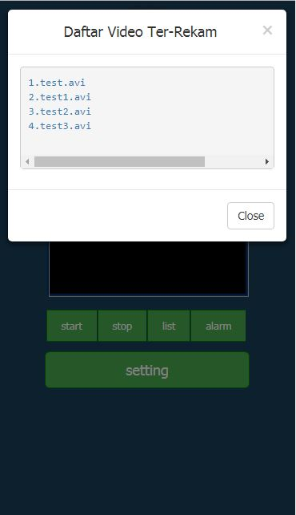
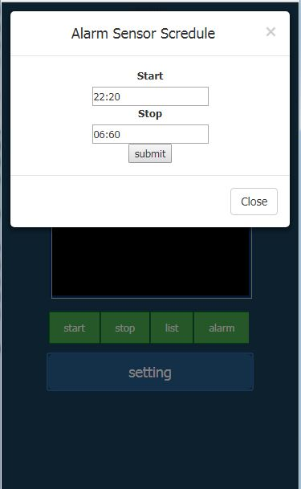
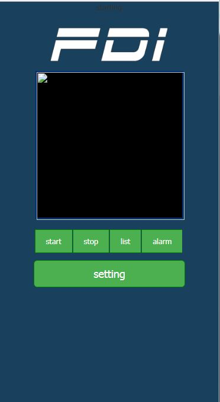

# openwrt fdicctv 1.0.0

percobaan openwrt fdicctv pertama

pastikan internet di router sudah sedia

peralatan yang di sediakan:

<pre>
router openwrt [daya cukup]
usb flash / microsd + adapter [exroot]
web camera uvc/yuv support
usb hub [ yang recomended ]
usb audio [soudcard recomended]
</pre>

buka putty pada openwrt shell command

<pre>
opkg update
opkg install git git-http
export GIT_SSL_NO_VERIFY=1
git clone https://github.com/friyadhibiermann/fdicctv.git
cd fdicctv
chmod 0755 ./install
./install
</pre>

laporkan jika ada error di group fb OPENWRT INDONSEIA

mari diskusi

PENTING DI TEST COMMAND BERIKUT:

<pre>
command yang bisa di coba: 
fdi_cam start
fdi_cam stop
fdi_cam rec
fdi_cam mail
uci show fdicctv
</pre>
# preview

